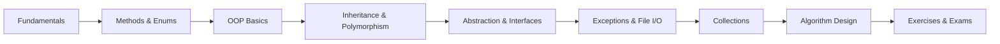

<div align="center">

# 🧩 C# Learning Journey

### A curated collection of C# fundamentals, Object-Oriented Programming, and Algorithm Design


&nbsp;&nbsp;&nbsp;


<br/>


</div>

---

## 📖 Overview

This repository documents my hands-on journey learning **C#** — from language fundamentals all the way to algorithm design techniques. It is organized as a set of small, focused, runnable snippets, each illustrating a single concept. The code spans the core building blocks of the language, the four pillars of **Object-Oriented Programming**, the **.NET base class library**, and classic **algorithm design paradigms** (Brute Force, Divide & Conquer, Transform & Conquer, Dynamic Programming).

> 🎯 **Goal:** Build a strong, practical foundation in C# / .NET and computer-science problem solving through bite-sized, well-commented examples and exercises.

---

## 🛠️ Tech Stack & Tooling

| Category | Technology | Notes |
| :--- | :--- | :--- |
| **Language** | C# | Modern C# (top-level statements, string interpolation, expression-bodied members) |
| **Runtime / SDK** | .NET (.NET 6+ / .NET Core) | Cross-platform runtime used to compile & run the samples |
| **Compiler** | Roslyn (`csc`) | The C# compiler shipped with the .NET SDK |
| **Editor** | Visual Studio Code | `.vscode/` is git-ignored |
| **Diagramming** | draw.io | Used for class design (e.g. the Fraction class diagram) |
| **Reference** | Java | A side-by-side Java example is included for `Comparable` |

### 📦 Frameworks & Namespaces Used

All examples rely on the **.NET Base Class Library (BCL)** — no external NuGet packages required.

| Namespace | Purpose | Where it's used |
| :--- | :--- | :--- |
| `System` | Core types, `Console` I/O, exceptions | Throughout |
| `System.IO` | File reading / writing | `File.cs` |
| `System.Collections.Generic` | `List<T>`, `Dictionary<TKey,TValue>`, sets | `exercises/Lession2/` |
| `System.Linq` | Query & transformation operators | Algorithm exercises |
| `System.Text.RegularExpressions` | Pattern matching & text splitting | `exercises/Lession2/Dictionary.cs` |

---

## 📚 What I Learned

<table>
<tr>
<td valign="top" width="50%">

### 🔤 C# Fundamentals
- ✅ Variables & data types
- ✅ Type casting & conversions
- ✅ Strings & string formatting
- ✅ Math operations
- ✅ Arrays, jagged & multi-dimensional arrays
- ✅ Loops & `foreach`
- ✅ User input & `Console` I/O
- ✅ Methods & parameter passing
- ✅ Enums (basic, typed & `[Flags]`)
- ✅ Structs

</td>
<td valign="top" width="50%">

### 🧱 Object-Oriented Programming
- ✅ Classes & objects
- ✅ Constructors
- ✅ Encapsulation (`get` / `set`, access modifiers)
- ✅ Inheritance & polymorphism
- ✅ Abstraction & abstract classes
- ✅ Interfaces (single & multiple)
- ✅ `IComparable` & custom comparison

</td>
</tr>
<tr>
<td valign="top">

### ⚙️ Core .NET Skills
- ✅ Exception handling (`try` / `catch` / `finally`)
- ✅ Custom exceptions & `throw`
- ✅ File I/O with `System.IO.File`
- ✅ Collections: `List`, `Dictionary`, `SortedList`, `SortedSet`
- ✅ Regular expressions

</td>
<td valign="top">

### 🧠 Algorithm Design
- ✅ **Brute Force** — exponentiation, polynomials, closest pair
- ✅ **Divide & Conquer** — exponent, closest pair, array rearrange
- ✅ **Transform & Conquer** — Horner's rule, intersections, sums
- ✅ **Dynamic Programming** — binomial coefficient
- ✅ Complexity analysis (e.g. `O(n)` vs `O(1)`)

</td>
</tr>
</table>

---

## 🗂️ Repository Structure

```
CSharp/
├── 🔤 Fundamentals (root)
│   ├── variables.cs · dataTypes.cs · typeCasting.cs · string.cs · math.cs
│   ├── array.cs · foreach.cs · input.cs · methods.cs · enums.cs
│   └── boolean.cs
│
├── 🧱 Object-Oriented Programming (root)
│   ├── ClassAndObject.cs · constructor.cs · animalClass.cs
│   ├── get&Set.cs · accessModifiers.cs
│   ├── inheritance&Polymorphism.cs · AbstractionClass.cs
│   └── InterfaceClass.cs
│
├── ⚙️ Core .NET (root)
│   ├── exception.cs
│   └── File.cs
│
├── 🧠 algorithms/
│   ├── BruteForce_a^n.cs · BruteForce_polynomial.cs · ClosestPair.cs
│   ├── sum_of_squares.cs · linear_polynominal.cs · counting_SubStringAB.cs
│   ├── DivideAndConquer/         # ExponentAn, ClosestPair, FindBiggestElement, RearrageArray
│   ├── TransformAndConquer/      # HornerRule, Intersection, FindSums, Distance, BiggestProduct
│   └── DynamicProgramming/       # BinomialCoefficient
│
├── 📝 exercises/
│   ├── Lesson1/                  # Clauses, Arrays, MathExpression, PassingParameters, Struct&Enum
│   ├── Lession2/                 # List, Dictionary, SortedList, SortedSet
│   ├── Lesson3/                  # OOP design (Fraction class)
│   ├── Comparable/               # IComparable in C# + a Java reference example
│   ├── abstractEx/               # geometry
│   └── fraction/                 # FractionClass.drawio diagram
│
└── 🎓 examinations/              # Practice exams: 22-23CLC, 24-25, 24-25CLC
```

---

## 🚀 Getting Started

### Prerequisites

- [.NET SDK](https://dotnet.microsoft.com/download) (6.0 or later) — check your version:
  ```bash
  dotnet --version
  ```

### Running a sample

Most files are self-contained snippets. The simplest way to run a single file is to create a throwaway console project and drop the file in:

```bash
# 1. Create a scratch console app
dotnet new console -o scratch
cd scratch

# 2. Replace Program.cs with the example you want to run
cp ../variables.cs Program.cs

# 3. Run it
dotnet run
```

> 💡 Some files (e.g. `exception.cs`, `File.cs`) use **top-level statements**, while others define their own `Main` method. Use one `Main`/top-level entry point per project.

Alternatively, install [`dotnet-script`](https://github.com/dotnet-script/dotnet-script) to execute single `.cs` files directly:

```bash
dotnet tool install -g dotnet-script
dotnet script variables.cs
```

---

## 🧭 Suggested Learning Path



1. **Fundamentals** → variables, data types, casting, arrays, loops, methods
2. **OOP** → classes, constructors, encapsulation, inheritance, abstraction, interfaces
3. **Core .NET** → exceptions, file I/O, collections, regex, `IComparable`
4. **Algorithms** → brute force → divide & conquer → transform & conquer → dynamic programming
5. **Practice** → exercises by lesson and past examination problems

---

## 📊 Repository at a Glance

| Area | Highlights |
| :--- | :--- |
| 🔤 **Fundamentals** | 11+ standalone topic files covering syntax basics |
| 🧱 **OOP** | All four pillars demonstrated with runnable examples |
| 🧠 **Algorithms** | 4 design paradigms across 3 dedicated folders |
| 📝 **Exercises** | Structured lessons (1–3) + comparison with Java |
| 🎓 **Exams** | Real practice problems from multiple academic terms |

---

<div align="center">

### 👨‍💻 Author

**Huy ([@DZT711](https://github.com/DZT711))**

⭐ *If you find this helpful, consider giving the repo a star!*

</div>
